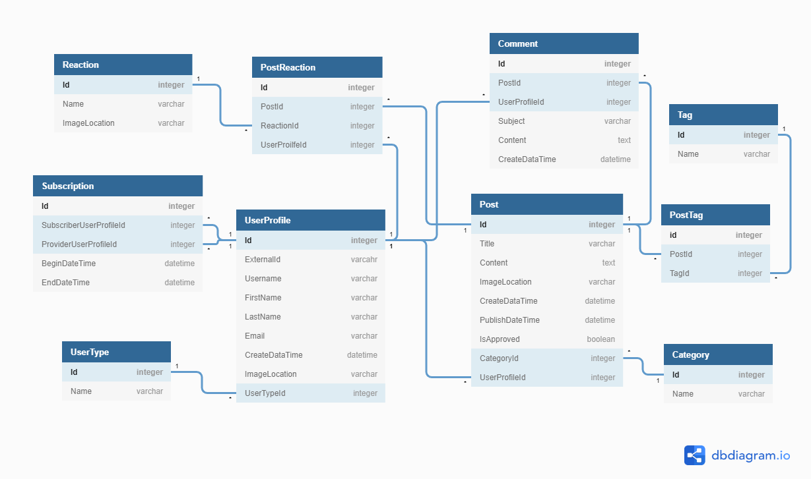

# Tabloid MVC

Good news, everyone, our [Tabloid CLI Proof of Concept](https://github.com/nashville-software-school/TabloidCLI) did it's job! We were able to test our business idea after a minimal amount of development time. And we learned people don't want to keep a list of other people's blog content. What they really want is to make their own content.

So it's time to pivot. We're still going to focus on long-form writing, but not we'll let people write their own posts.

## Tabloid Prototype

We're ready to build a [working prototype](https://en.wikipedia.org/wiki/Prototype) of the Tabloid application. This prototype will help us better understand and refine our product. It won't be as feature-rich or as polished as our final product, but it should implement the core features and be as close to our _current vision_ of the product as possible. 

We know we want a multi-user web application with a rich user experience. For the final product, we we'd like to use react, but we'd like to develope the prototype as rapidly as possible. The architect has decided that ASP.NET Core MVC is the perfect balance of features and rapid development.

### Users

Tabloid MVC will have two types of users:

* **Authors** can create Posts, manage their own Posts, and read and comment on other authors' posts.

* **Admins** can do all the things authors can do, but are also in charge of managing all the data in the system.

### ERD

